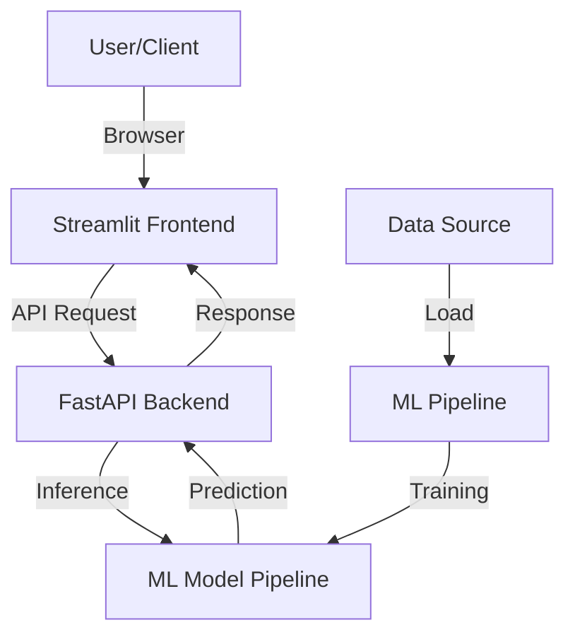

# 🚀 Salary Intelligence AI: Enterprise Compensation Predictor

[](https://fastapi.tiangolo.com/)
[](https://streamlit.io/)
[](https://scikit-learn.org/)
[](https://www.docker.com/)

An end-to-end Machine Learning solution for predicting professional salaries with high precision. This project demonstrates a production-grade architecture combining an optimized ML pipeline, a scalable FastAPI backend, and an interactive Streamlit dashboard.

---

## ✨ Key Features

- **Production-Grade ML Pipeline**: Automated feature engineering, model comparison (RandomForest, GradientBoosting, Ridge), and selection of the best-performing model.
- **RESTful API Backend**: Scalable FastAPI service with Pydantic validation, health monitoring, and high-performance inference.
- **Enterprise Dashboard**: Sleek, glassmorphism UI with interactive Plotly analytics and real-time market intelligence.
- **Containerized Architecture**: Fully Dockerized environment using `docker-compose` for seamless local development and deployment.
- **Advanced Auth System**: Secure user registration and multi-role (Admin/User) authentication logic.

## 🏗️ Architecture



## 🛠️ Tech Stack

- **Data Science**: Python, Pandas, Scikit-Learn, Joblib
- **API**: FastAPI, Uvicorn, Pydantic
- **Frontend**: Streamlit, Plotly, Custom CSS
- **DevOps**: Docker, Docker-Compose

---

## 🚀 Getting Started

### Prerequisites
- Python 3.12+
- Docker & Docker Compose (Optional)

### Installation & Setup

1. **Clone the Repository**
   ```bash
   git clone https://github.com/yourusername/salary-prediction-ai.git
   cd salary-prediction-ai
   ```

2. **Run Model Training**
   ```bash
   python -m src.trainer
   ```

3. **Start the Services (Using Docker)**
   ```bash
   docker compose up --build
   ```

4. **Access the Application**
   - **Frontend**: [http://localhost:8501](http://localhost:8501)
   - **API Docs**: [http://localhost:8000/docs](http://localhost:8000/docs)

---

## 📈 Model Performance

The current champion model is a **Ridge Regression Pipeline** achieving:
- **R² Score**: 0.9770
- **Mean Absolute Error**: ₹5,136.06

---

## 👨‍💻 Author
**Soumyajit Nag**
- [LinkedIn](https://linkedin.com/in/yourprofile)
- [Portfolio](https://yourportfolio.com)
